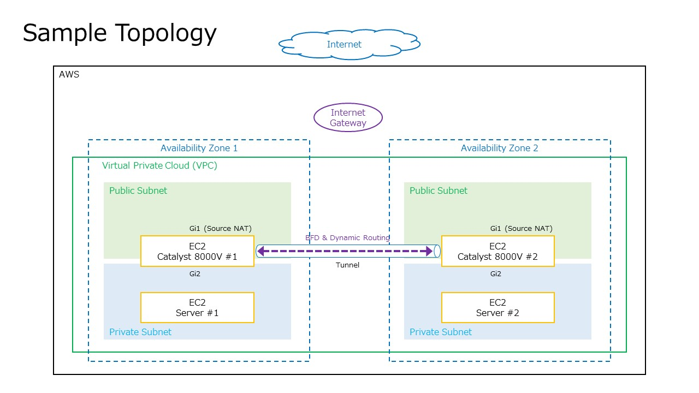
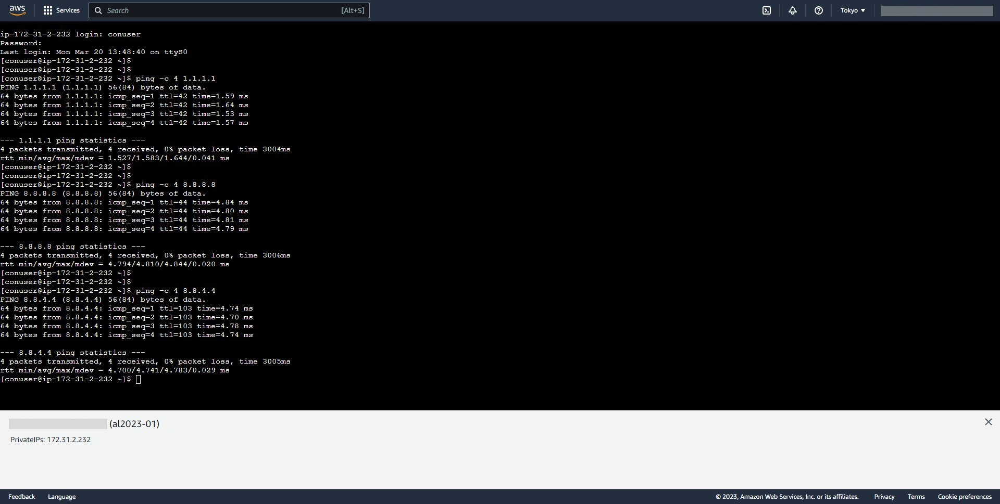

# Sample configuration of Cisco Catalyst 8000V HA on AWS

## 前提情報
AWS 上の Cisco Catalyst 8000V で冗長化を行うには **csr-aws-ha** の Python スクリプトの設定が必要になります。
AWS 基盤が Route table の制御を行っているため、障害検知時に Route table の Target の書き換えが必要になるのが理由です。  

Guestshell 上で動作する csr-aws-ha の設定は ```create_node.sh``` コマンドで行います。
```create_node.sh``` コマンドは IOX-XE のコマンドとして設定を指定できない都合で EC2 インスタンスの User Data の ```Section: Scripts``` で外部の bash スクリプトと引数を指定して実行させます。  


## 目的
本サンプルでは ```create_node.sh``` コマンドを実行するために、外部から呼び出すための bash スクリプトを用意しました。
GitHub 上に bash スクリプトをホスティングすることによって Web Server のようなファイル格納先の用意を不要にする意図も含んでいます。
そしてすぐに環境を構築して試せるように Terraform の設定も用意しております。  

スクリプトを用いた独特な実装になっているため、下記のドキュメントに目を通すようにしてください。  

Cisco Catalyst 8000V Edge Software High Availability Configuration Guide - Cisco  
[https://www.cisco.com/c/en/us/td/docs/routers/C8000V/HighAvailability/c8000v-high-availability-configuration-guide.html]  

実際の導入では bash スクリプトに環境固有の情報を記載する関係で GitHub で Public に公開できない場合も考えられます。
そのような場合では S3 にアップロードしてのアクセス制限などを検討してください。  


## AWS 上の構成


Public Subnet と Private Subnet から成る構成にしております。
Private Subnet 上の Server (Amazon Linux 2023) は Catalyst 8000V を経由しないと Internet へアクセスできないようになっています。
そのため Serial Console を利用して Server にアクセスします。

実際の導入では IPsec を用いて対向拠点に対してトンネリングを行う設計が想定されます。
設計次第ではトンネルの張り方がたすき掛けとなり、非対称ルーティングが発生する可能性があるためアクセス制御系の設定で通信がドロップされないように留意してください。  


## 障害検知のメカニズム
csr-aws-ha による障害検知のメカニズムはいくつかのネットワーク技術で成り立っています。  

* Catalyst 8000V 同士 (Primary と Secondary) のトンネリング (IPsec, VXLAN)  

* トンネル上の動的ルーティング (EIGRP, BGP, OSPF)  

* BFD (Bidirectional Forwarding Detection)  

冗長化対象の Catalyst 8000V 同士でトンネリングを行い、動的ルーティングを動作させて BFD によって対向インスタンスの監視を行います。
対向インスタンスがダウンすると BFD によって障害検知が行われて csr-aws-ha が Route table の Target を書き換えます。  

Primary の Catalyst 8000V が復旧した場合は crontab によって 5 分刻みのタイミングで Route table の切り戻し処理が行われます。  
本動作はドキュメント上で明記されていませんが Guestshell 上で ```crontab -l``` を実行すると分かります。  

```
[guestshell@guestshell ~]$ crontab -l
*/5 * * * * bash /home/guestshell/.local/lib/python3.6/site-packages/csr_ha/client_api/revert_nodes.sh
[guestshell@guestshell ~]$
```

本サンプルの障害検知用の設定は下記ドキュメントの ```Configuring EIGRP over Virtual Tunnel Interfaces``` に記載のコンフィグをベースにしており、トンネリングには IPsec を、動的ルーティングには EIGRP を採用しています。  

Cisco Catalyst 8000V Edge Software High Availability Configuration Guide - Configure High Availability [Cisco IOS XE 17] - Cisco  
[https://www.cisco.com/c/en/us/td/docs/routers/C8000V/HighAvailability/c8000v-high-availability-configuration-guide/configure-high-availability.html]  


## Section: Scripts の設定方法
Catalyst 8000V で外部の bash スクリプトを実行するには EC2 インスタンスの User Data で ```Section: Scripts``` を記述します。

### Section: Scripts の書式
```Section: Scripts``` の構文は下記の例のように 2 行目以降で実行対象の bash スクリプトの URL を記述します。そしてダウンロードしたスクリプトに渡すための引数を指定します。  

```
Section: Scripts
https://www.example.test/script.sh arg1 arg2
```

### Section: Scripts で同一 URL を複数指定
Route table の設定はひとつとは限りませんが、下記のように全く同じ URL を複数指定すると最後の行が優先されてしまうため留意してください。  

```
Section: Scripts
https://www.example.test/echo_msg.sh Hello
https://www.example.test/echo_msg.sh World
```

### Section: Scripts で同一 URL 且つ URL Paramter を一意にして複数指定
Route table に複数の Route の設定を行いたい場合は、オリジナルの URL に対して URL Parameter を一意に指定して使い回す回避策があります。  

```
Section: Scripts
https://www.example.test/echo_msg.sh?v=dummy1 Hello
https://www.example.test/echo_msg.sh?v=dummy2 World
```

### サンプルの bash スクリプトと引数
本サンプルの bash スクリプト ([```script.sh```](./script.sh)) では ```create_node.sh``` コマンドに実行するための引数を順番に単に羅列しています。
```create_node.sh``` コマンドで指定が必要な引数は下記のドキュメントを参照してください。  

Cisco Catalyst 8000V Edge Software High Availability Configuration Guide - Configure High Availability on Cisco Catalyst 8000V Running on Amazon Web Services [Cisco IOS XE 17] - Cisco  
[https://www.cisco.com/c/en/us/td/docs/routers/C8000V/HighAvailability/c8000v-high-availability-configuration-guide/configure-high-availability-for-aws.html]  


## Terraform のサンプル設定ファイルの使い方
Terraform のサンプル設定ファイルの使い方を解説します。  


### IAM の権限設定
Catalyst 8000V の Guestshell から csr-aws-ha によって AWS の設定を書き換えるため Terraform は IAM の設定が含まれています。
そのため AWS に対する権限が制限されている環境では IAM 関連設定の新規作成で失敗する可能性があります。  


### SSH 公開鍵の書き換え
SSH 公開鍵が ```public_key``` の値に指定されているので使用者の公開鍵に書き換えてください。  

```
resource "aws_key_pair" "keypair" {
  key_name = "keypair_for_terraform"
  # TODO: CHANGE KEYPAIR
  public_key = "ssh-rsa ABCDEF...."
}
```

### Catalyst 8000V へのログイン
Catalyst 8000V は Public IPv4 address を確認して SSH の公開鍵認証でログインしてください。
Username は ```ec2-user``` になります。  


### Server へのログイン
Server は Private Subnet に存在しており Internet 側からは SSH できないため Serial Console からアクセスします。  

Serial Console へログインするための情報は User Data に指定しており、下記のようになっております。  

| Username | Password                           |
|----------|------------------------------------|
| conuser  | ```terraform output``` の出力を参照 |


Password の情報はランダムにしているため ```terraform output``` の出力情報を参照してください。  
下記は出力例になります。  

```
ec2-user:~/environment $ terraform output
output-conuser-password = "10}0%8RG_KKr<I&$@Q"
ec2-user:~/environment $ 
```

下記は Serial Console への接続時の参考画面です。  




### 疎通確認
正常時と障害時の動作確認が行いやすくなるように疎通確認系の情報を書き留めておきます。  


#### 正常時の副系経由の通信
正常時の Google Public DNS (```8.8.8.8```, ```8.8.4.4```) 宛の通信は副系 (Catalyst 8000V #2) を経由するように Route table を設定しています。
そのため副系のインスタンス障害が発生させると、正系 (Catalyst 8000V #1) 側に Route table の target が切り替わるかを確認できます。  

疎通確認には ```ping 8.8.8.8``` や ```ping 8.8.4.4``` のコマンドを利用してください。  


#### Public IPv4 address の確認
Catalyst 8000V は Source NAT を実行しているため、実際に通信経路が切り替わったかはグローバル IP アドレスを参照すれば判別が可能です。
 Public IPv4 address を確認できる Web サイトと通信できるように HTTP と HTTPS を Security Group で許可しています。  

```
[conuser@ip-172-31-3-51 ~]$ curl http://httpbin.org/ip
{
  "origin": "13.112.###.###"
}
[conuser@ip-172-31-3-51 ~]$ 
```

## 本サンプルの GitHub の URL
サンプルをダウンロードしてローカルなどで編集している際に、大元の情報が気になった際は下記の URL を参照してください。  

[https://github.com/myhomenwlab/Sample_configuration_of_Cisco_Catalyst_8000V_HA_on_AWS]  
